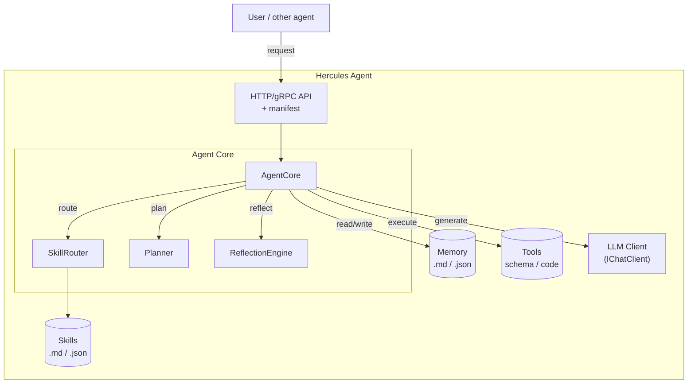
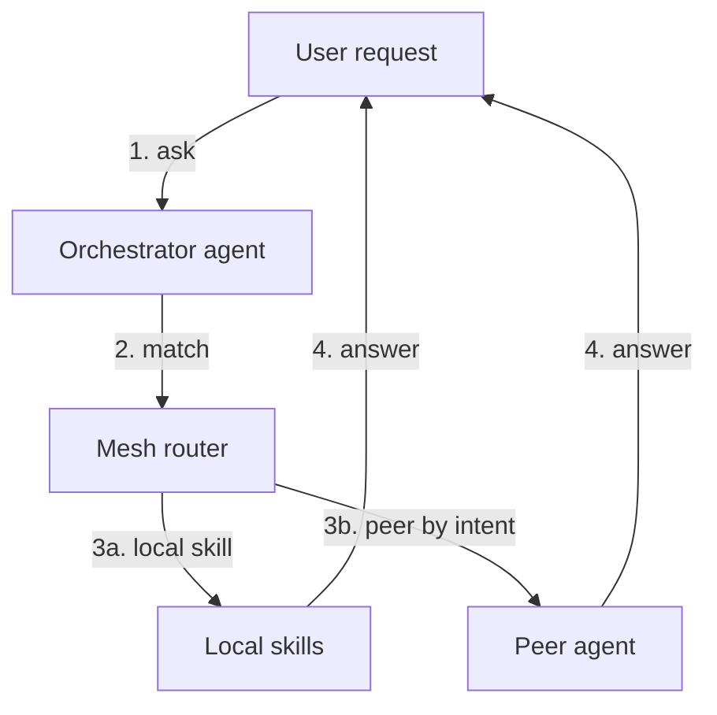

# Agent Mesh Architecture

Hercules is designed as a **micro-agent**: the smallest possible autonomous unit that can reason, remember, and improve. This document explains how multiple Hercules agents can be combined into an **agent mesh** — a decentralized network of specialized agents that discover, call, and learn from each other, much like microservices form an application architecture.

---

## 1. Why micro-agents?

A single large assistant tries to be good at everything. That creates several problems:

- **Context bloat** — the prompt grows with every skill and memory fact.
- **Skill conflicts** — unrelated skills compete for attention.
- **Single point of failure** — if the model is down or the agent is misconfigured, everything stops.
- **Hard to specialize** — coding, finance, legal, and creative tasks need different models, prompts, and tools.

A **micro-agent** does the opposite:

- One clearly defined responsibility.
- Small, fast, and cheap to run.
- Can use the smallest model that fits its task.
- Can be developed, tested, and deployed independently.
- Can be chained into a mesh when a problem spans multiple domains.

---

## 2. Anatomy of a Hercules micro-agent



Each agent is:

- **Self-contained** — one executable, one `data/` folder, one config.
- **Observable** — health endpoint, metrics, reflection reports.
- **Callable** — exposes a small API for incoming requests.
- **Discoverable** — publishes a manifest of capabilities.

---

## 3. Agent manifest

Every agent publishes a manifest so others can decide whether to route a request to it.

```json
{
  "agentId": "hercules-code-assistant",
  "version": "1.2.0",
  "displayName": "Code Assistant",
  "description": "Refactors, explains, and generates C# code.",
  "endpoint": "http://localhost:5001",
  "transport": "http",
  "auth": { "type": "apikey", "header": "X-Api-Key" },
  "capabilities": [
    { "name": "csharp-refactor", "triggers": ["refactor", "clean up", "simplify"] },
    { "name": "code-review", "triggers": ["review", "check this code"] }
  ],
  "models": {
    "primary": "yandexgpt",
    "fallback": ["ollama-local"]
  },
  "health": "http://localhost:5001/api/health"
}
```

The manifest is served at a well-known URL, e.g. `GET /agent.manifest.json`.

---

## 4. Inter-agent protocol

Agents communicate with a small JSON envelope.

### Request

```json
{
  "requestId": "550e8400-e29b-41d4-a716-446655440000",
  "sender": "hercules-orchestrator",
  "intent": "csharp-refactor",
  "payload": {
    "message": "Refactor this method to use async/await",
    "context": { "file": "Program.cs", "line": 42 }
  },
  "replyTo": "http://localhost:5000/api/mesh/callback",
  "timeoutMs": 30000,
  "traceId": "abc123"
}
```

### Response

```json
{
  "requestId": "550e8400-e29b-41d4-a716-446655440000",
  "status": "ok",
  "agent": "hercules-code-assistant",
  "mode": "skill",
  "skill": "csharp-refactor",
  "result": {
    "text": "Here is the refactored method...",
    "confidence": 0.91
  },
  "traceId": "abc123"
}
```

The protocol is intentionally minimal. It can be carried over HTTP, gRPC, or a message bus.

---

## 5. Mesh routing

When a local agent receives a request, it first tries to solve it locally. If it cannot, it forwards the request to a peer.



Routing decisions are based on:

1. Local skill match and confidence.
2. Peer capability manifest.
3. Historical success rate of each peer for this intent.
4. Latency, cost, and current load.
5. User consent and trust policy.

A dedicated **Mesh Router** module makes this decision transparent and testable.

---

## 6. Discovery patterns

Agents can find each other in several ways:

| Pattern | Best for |
| ------- | -------- |
| **Static config** | Local development, small fixed topologies |
| **Registry** | Production meshes with a known agent catalog |
| **mDNS / Bonjour** | LAN meshes, zero-config setups |
| **Message bus** | Event-driven meshes, dynamic scaling |

The registry itself can be another Hercules agent or a simple SQLite-backed service.

---

## 7. Shared learning

Each agent learns independently, but the mesh can also improve collectively:

- **Skill marketplace** — agents export/import skill packages.
- **Memory sync** — selected facts can be replicated across trusted agents.
- **Reflection federation** — reflection reports can include peer performance and suggest new peer links.
- **LLM judge fan-out** — the same request can be sent to several agents; the best answer is selected and the winner's skill is reinforced.

---

## 8. Trust and security

A mesh is only as safe as its weakest link. Minimum safeguards:

- **Authentication** — mutual TLS or API keys between agents.
- **Authorization** — per-agent ACLs: which peers can call which skills and read which memory.
- **Sandboxing** — file-system and shell tools run in isolated directories.
- **Audit log** — every inter-agent request and response is logged with `traceId`.
- **Rate limits and budgets** — per-peer and per-mesh LLM cost limits.

---

## 9. Example topologies

### Single machine, multiple agents

```text
┌─────────────┐     ┌─────────────┐     ┌─────────────┐
│   Code      │     │   Writing   │     │   Planner   │
│   Agent     │◀───▶│   Agent     │◀───▶│   Agent     │
│   :5001     │     │   :5002     │     │   :5003     │
└─────────────┘     └─────────────┘     └─────────────┘
```

### Gateway-fronted mesh

```text
                       ┌──────────────┐
                       │   Gateway    │
                       │  (ingress)   │
                       └──────┬───────┘
                              │
         ┌────────────────────┼────────────────────┐
         │                    │                    │
    ┌────▼────┐          ┌─────▼─────┐        ┌────▼────┐
    │ Agent A │◀────────▶│  Agent B  │◀──────▶│ Agent C │
    └─────────┘          └───────────┘        └─────────┘
```

### Message-bus mesh

```text
         ┌──────────┐
         │   NATS   │
         │  / Rabbit│
         └────┬─────┘
              │
    ┌─────────┼─────────┐
    │         │         │
┌───▼───┐ ┌───▼───┐ ┌───▼───┐
│Agent 1│ │Agent 2│ │Agent 3│
└───────┘ └───────┘ └───────┘
```

---

## 10. Comparison with microservices

| Aspect | Microservices | Agent Mesh |
| ------ | ------------- | ---------- |
| Unit | Service | Micro-agent |
| Interface | REST/gRPC/events | Intent-based messages |
| Scaling | Horizontal pods | Agents with identical manifests |
| Discovery | Service registry | Capability registry + mDNS |
| Failure handling | Retry / circuit breaker | Same, plus LLM fallback |
| Reasoning | External | Built-in |
| Memory | Database | Local + shared memory sync |
| Learning | Re-deploy | Self-improving skills |

---

## 11. IoT deployment example

The micro-agent idea is especially useful for **Raspberry Pi edge deployments**. One Pi runs one Hercules agent with one responsibility. For example:

- A `hercules-greenhouse` agent on a Pi monitors soil moisture, temperature, and humidity, waters plants via a relay, and answers the owner's Telegram questions.
- A `hercules-coldchain` agent on a Pi in a pharmacy fridge logs temperature every minute and generates a compliance report.
- A `hercules-closet` agent in a server cabinet pings devices and shuts down non-critical gear if temperature spikes.

In every case the Pi is the **agent runtime**, while the LLM runs externally through a cloud provider. This keeps the device cheap, power-efficient, and easy to deploy at scale. See [docs/IOT-SCENARIOS-EN.md](IOT-SCENARIOS-EN.md) for a full catalog of B2C and B2B scenarios.

---

## 12. Roadmap connection

The mesh is built in phases:

1. **Phase 1** — a single autonomous micro-agent works.
2. **Phase 2** — skills and tools become portable packages.
3. **Phase 3** — agents can discover and call each other.
4. **Phase 4** — the mesh can route, retry, and learn collectively.
5. **Phase 5** — the mesh is observable, secure, and production-ready.

See [docs/ROADMAP-EN.md](ROADMAP-EN.md) for dates and deliverables.

---

## 13. Open questions

- Should the mesh have a single "orchestrator" agent or be fully peer-to-peer?
- How should agents negotiate pricing and quota when some use cloud LLMs and others run locally?
- What is the minimal shared memory format that preserves privacy?

These questions will be answered through prototypes and discussions as the project moves through Phase 3 and Phase 4.
