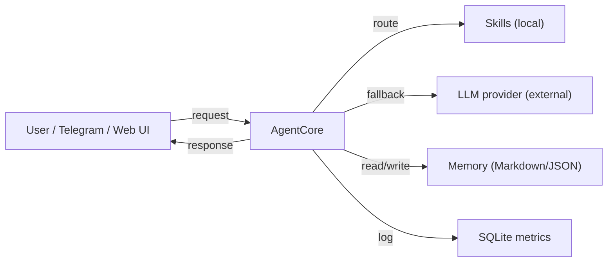
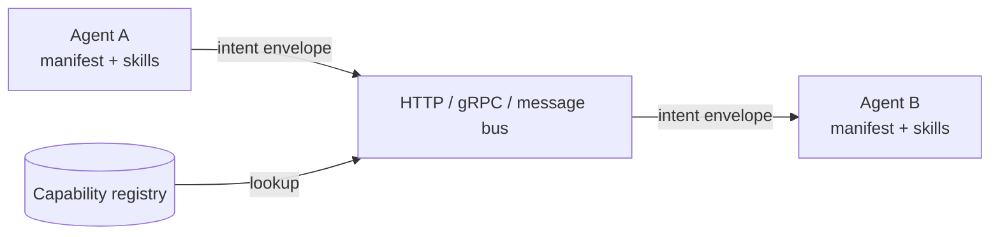
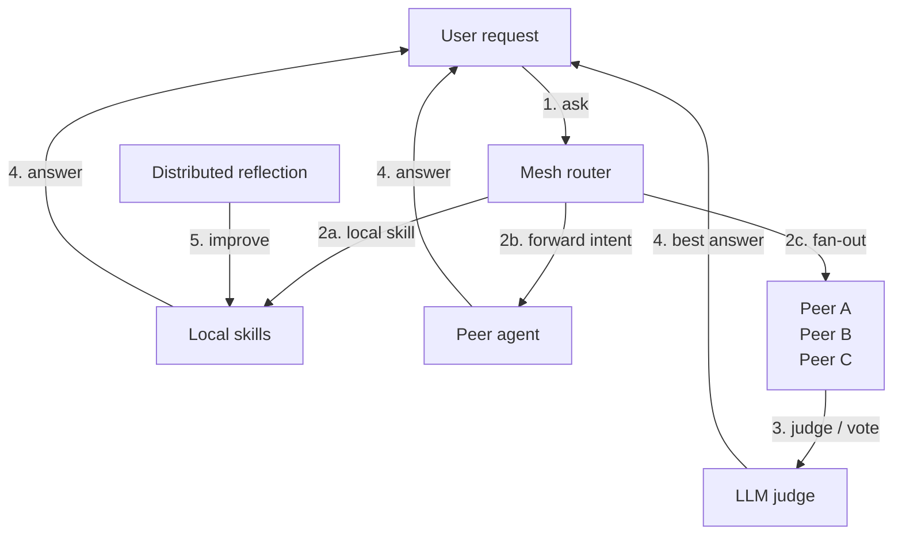

# Roadmap

This document describes the planned evolution of **Hercules** — a tiny, self-improving AI micro-agent on C# / .NET 10. The goal is not to build one large assistant, but to make the smallest possible autonomous unit that can later be composed into an **agent mesh**: a network of specialized micro-agents that discover, call, and learn from each other, similar to how microservices form an application architecture.

> For the current state of the project, see [CHANGELOG-EN.md](../CHANGELOG-EN.md).  
> For the mesh architecture concept, see [docs/AGENT-MESH-EN.md](AGENT-MESH-EN.md).

---

## Design constraints for a micro-agent

Every feature on this roadmap is evaluated against these constraints:

- **Single responsibility** — one agent does one thing well.
- **Small memory and disk footprint** — runs on modest hardware.
- **Self-contained runtime** — one executable, one config, one data folder.
- **OpenAI-compatible interface** — any LLM provider, local or cloud; edge devices use external LLM.
- **Discoverable and callable** — via lightweight protocol (HTTP/gRPC or message bus).
- **Versioned skills** — reusable, shareable, rollback-capable.
- **Edge-ready** — runs on Raspberry Pi with external LLM, buffers data offline.

---

## Phase 1 — Single autonomous unit (now → Q3 2026)

Goal: prove that one Hercules agent can operate independently, learn from its own traffic, and expose a clean API.

| # | Initiative | Outcome |
| - | ---------- | ------- |
| 1 | **Core agent loop** | `AgentCore` handles a request, routes it to a skill or direct LLM call, updates memory, and logs metrics. |
| 2 | **Skill lifecycle** | Skill creation, versioning, improvement, and deletion are fully automated with human-in-the-loop for high-risk changes. |
| 3 | **Hybrid storage** | Markdown/JSON for skills and memory + SQLite for logs and metrics; no external dependencies. |
| 4 | **Multi-provider LLM** | YandexGPT, Ollama Cloud/Local, LM Studio through `Microsoft.Extensions.AI` with automatic fallback. |
| 5 | **Interfaces** | CLI REPL, Telegram bot, ASP.NET Core Minimal API, Astro web UI. |
| 6 | **Tests and benchmarks** | `dotnet test` ≥ 70 % coverage; `dotnet run --benchmark` measures skill hit rate, latency, and memory growth. |

**Deliverable:** a standalone micro-agent anyone can run locally.

---

## Phase 2 — Composable skills and tool use (Q4 2026)

Goal: turn skills into portable, self-contained units that can be imported, exported, and chained. This is the foundation for **agent templates** used in IoT deployments.

| # | Initiative | Outcome |
| - | ---------- | ------- |
| 7 | **Skill package format** | A skill is a folder with `skill.meta.json`, `skill.prompt.md`, `skill.tests.json`, and optional `tool.schema.json`. |
| 8 | **Skill marketplace** | `data/Skills/marketplace/` with import/export CLI commands and a public template repository. |
| 9 | **Semantic routing** | `SkillRouter` ranks skills by query embedding similarity, not just keyword triggers. |
| 10 | **Tool registry** | Skills declare tools (HTTP, file-system, shell, database, GPIO/MQTT) loaded from `data/Tools/` with allow/deny lists. |
| 11 | **Agent templates** | Pre-built skill + memory + tool bundles for vertical scenarios (greenhouse, energy, cold-chain, server closet). |

**Deliverable:** one agent can compose multiple skills and tools internally, and a new vertical deployment starts from a template, not from scratch.

---

## Phase 3 — Inter-agent protocol (Q1 2027)

Goal: make agents talk to each other over a lightweight, language-agnostic protocol.

| # | Initiative | Outcome |
| - | ---------- | ------- |
| 12 | **Agent manifest** | Each agent publishes `agent.manifest.json`: name, version, capabilities, skills, endpoint, auth method. |
| 13 | **Capability registry** | A local registry (file or SQLite) lists known agents and what each can do. |
| 14 | **Inter-agent message format** | Standard JSON envelope: `requestId`, `sender`, `intent`, `payload`, `replyTo`, `timeout`. |
| 15 | **Transport options** | HTTP/gRPC endpoints plus optional message-bus adapter (RabbitMQ, NATS, Azure Service Bus). |
| 16 | **Discovery mechanisms** | Static config, mDNS/Bonjour, and registry lookup. |

**Deliverable:** two Hercules agents can discover each other and route a request from one to the other.

---

## Phase 4 — Mesh orchestration (Q2 2027)

Goal: a network of micro-agents behaves like one coherent agent system, with routing, retries, observability, and shared learning.

| # | Initiative | Outcome |
| - | ---------- | ------- |
| 17 | **Mesh router** | When a local skill is missing or confidence is low, the agent forwards the request to the most suitable peer agent. |
| 18 | **Fan-out / fan-in** | A request can be broadcast to several agents and the best answer selected by an LLM judge or voting. |
| 19 | **Retry and circuit breaker** | Failed peer calls are retried, logged, and eventually short-circuited. |
| 20 | **Distributed reflection** | Reflection reports include peer-agent performance and suggest new skills or peer relationships. |
| 21 | **Shared memory sync** | Optional synchronization of selected memory facts and skills across trusted agents in the mesh. |

**Deliverable:** a mesh of 3–5 Hercules agents can answer queries that no single agent could answer alone.

---

## Phase 5 — IoT/edge fleet and mesh operations (Q3 2027)

Goal: make the mesh production-ready, observable, and governable — including fleets of low-cost edge devices.

| # | Initiative | Outcome |
| - | ---------- | ------- |
| 22 | **Mesh dashboard** | Web UI shows live agent topology, traffic between agents, per-agent health, and skill usage heatmap. |
| 23 | **Centralized logging and tracing** | Every inter-agent call has a `traceId`; logs can be shipped to OpenTelemetry/Loki/etc. |
| 24 | **Identity and trust** | Mutual TLS or API-key trust between agents; per-agent access control lists for skills and memory. |
| 25 | **Rate limiting and quotas** | Per-agent and per-skill rate limits; LLM cost budgets across the mesh. |
| 26 | **Lifecycle management** | CLI and API to start, stop, update, and rollback agents in the mesh. |
| 27 | **Edge provisioning** | SD-card image / Docker image for Raspberry Pi with first-boot Wi-Fi and API-key activation flow. |
| 28 | **Offline resilience** | Agent buffers sensor logs and outgoing alerts; syncs with mesh/cloud when connectivity returns. |
| 29 | **Fleet templates** | One template per vertical (greenhouse, cold-chain, closet, vending) with validated hardware bill of materials. |

**Deliverable:** Hercules mesh can be deployed as a set of small services behind a gateway, and as a fleet of Raspberry Pi edge agents, with operational visibility.

---

## Long-term vision

Hercules becomes a **runtime for agent meshes**: tiny, self-improving, single-purpose agents that discover each other, delegate work, share skills, and learn collectively. A mesh can live on one machine, across a LAN, or in the cloud — composed like microservices, but with built-in reasoning, memory, and adaptation.

---

## How to influence the roadmap

- Open a [discussion](../../discussions) for ideas.
- Open an [issue](../../issues) for concrete bugs or proposals.
- See [CONTRIBUTING-EN.md](../CONTRIBUTING-EN.md) for contribution guidelines.
