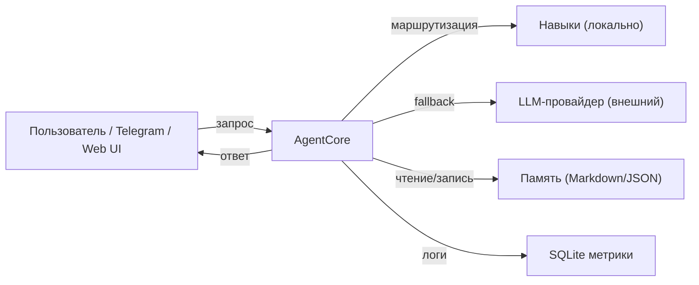
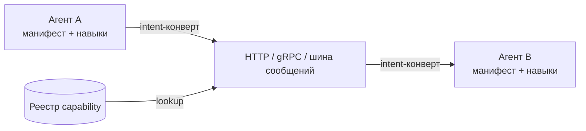
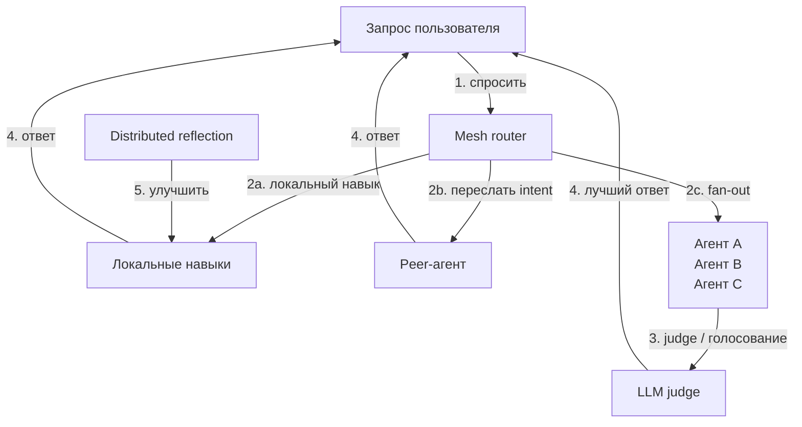

# Roadmap

Этот документ описывает план развития **Hercules** — крошечного самообучающегося ИИ-микроагента на C# / .NET 10. Цель не в том, чтобы построить одного большого ассистента, а в том, чтобы сделать минимально возможную автономную единицу, которую позже можно объединить в **agent mesh**: сеть специализированных микро-агентов, которые находят друг друга, вызывают друг друга и учатся друг у друга — по аналогии с тем, как микросервисы формируют прикладную архитектуру.

> Текущее состояние проекта см. в [CHANGELOG-RU.md](../CHANGELOG-RU.md).  
> Концепция mesh-архитектуры — в [docs/AGENT-MESH-RU.md](AGENT-MESH-RU.md).

---

## Ограничения проектирования микро-агента

Каждая фича в roadmap оценивается по этим ограничениям:

- **Single responsibility** — один агент делает одно дело хорошо.
- **Малый ресурсный след** — работает на скромном железе.
- **Самодостаточный runtime** — один исполняемый файл, один конфиг, одна папка данных.
- **OpenAI-совместимый интерфейс** — любой LLM-провайдер, локальный или облачный; edge-устройства используют внешний LLM.
- **Discoverable and callable** — обнаруживаем и вызываем по лёгкому протоколу (HTTP/gRPC или шина сообщений).
- **Версионированные навыки** — reusable, shareable, rollback-capable.
- **Готовность к edge** — работает на Raspberry Pi с внешним LLM, буферизирует данные офлайн.

---

## Phase 1 — Один автономный юнит (сейчас → Q3 2026)

Цель: доказать, что один агент Hercules может работать самостоятельно, учиться на собственном трафике и отдавать чистый API.

| # | Инициатива | Результат |
| - | ---------- | --------- |
| 1 | **Core agent loop** | `AgentCore` обрабатывает запрос, маршрутизирует на навык или прямой вызов LLM, обновляет память и пишет метрики. |
| 2 | **Жизненный цикл навыка** | Создание, версионирование, улучшение и удаление навыков полностью автоматизированы; human-in-the-loop для высокорисковых изменений. |
| 3 | **Гибридное хранилище** | Markdown/JSON для навыков и памяти + SQLite для логов и метрик; без внешних зависимостей. |
| 4 | **Мульти-провайдер LLM** | YandexGPT, Ollama Cloud/Local, LM Studio через `Microsoft.Extensions.AI` с автоматическим fallback. |
| 5 | **Интерфейсы** | CLI REPL, Telegram-бот, ASP.NET Core Minimal API, Astro веб-интерфейс. |
| 6 | **Тесты и бенчмарки** | `dotnet test` ≥ 70 % покрытия; `dotnet run --benchmark` измеряет hit-rate навыков, latency и рост памяти. |

**Доставляемый результат:** standalone микро-агент, который любой может запустить локально.

---

## Phase 2 — Компонуемые навыки и инструменты (Q4 2026)

Цель: превратить навыки в переносимые, самодостаточные единицы, которые можно импортировать, экспортировать и связывать в цепочки. Это фундамент для **шаблонов агентов**, используемых в IoT-развёртываниях.

| # | Инициатива | Результат |
| - | ---------- | --------- |
| 7 | **Формат пакета навыка** | Навык — это папка с `skill.meta.json`, `skill.prompt.md`, `skill.tests.json` и опциональным `tool.schema.json`. |
| 8 | **Маркетплейс навыков** | `data/Skills/marketplace/` с командами импорта/экспорта в CLI и публичным репозиторием шаблонов. |
| 9 | **Семантическая маршрутизация** | `SkillRouter` ранжирует навыки по embedding-сходству с запросом, а не только по ключевым словам. |
| 10 | **Реестр инструментов** | Навыки декларируют инструменты (HTTP, файловая система, shell, БД, GPIO/MQTT), загружаемые из `data/Tools/` с allow/deny-списками. |
| 11 | **Шаблоны агентов** | Готовые bundles навыков + памяти + инструментов для вертикальных сценариев (теплица, энергия, холодовая цепь, серверная). |

**Доставляемый результат:** один агент может внутри себя компоновать несколько навыков и инструментов, а новое вертикальное развёртывание начинается с шаблона, а не с нуля.

---

## Phase 3 — Межагентный протокол (Q1 2027)

Цель: научить агентов общаться друг с другом по лёгкому, языконезависимому протоколу.

| # | Инициатива | Результат |
| - | ---------- | --------- |
| 12 | **Agent manifest** | Каждый агент публикует `agent.manifest.json`: имя, версия, capabilities, навыки, endpoint, способ аутентификации. |
| 13 | **Реестр capability** | Локальный реестр (файл или SQLite) со списком известных агентов и того, что каждый умеет. |
| 14 | **Формат межагентного сообщения** | Стандартный JSON-конверт: `requestId`, `sender`, `intent`, `payload`, `replyTo`, `timeout`. |
| 15 | **Варианты транспорта** | HTTP/gRPC endpoint'ы плюс опциональный адаптер шины сообщений (RabbitMQ, NATS, Azure Service Bus). |
| 16 | **Механизмы discovery** | Статический конфиг, mDNS/Bonjour и lookup по реестру. |

**Доставляемый результат:** два агента Hercules могут найти друг друга и перенаправить запрос от одного к другому.

---

## Phase 4 — Оркестрация mesh (Q2 2027)

Цель: сеть микро-агентов ведёт себя как единая агентская система с маршрутизацией, ретраями, observability и совместным обучением.

| # | Инициатива | Результат |
| - | ---------- | --------- |
| 17 | **Mesh router** | Когда локальный навык отсутствует или уверенность низка, агент пересылает запрос наиболее подходящему peer-агенту. |
| 18 | **Fan-out / fan-in** | Запрос можно разослать нескольким агентам, а лучший ответ выбрать через LLM-judge или голосование. |
| 19 | **Retry и circuit breaker** | Упавшие вызовы к peer'ам ретраятся, логируются и в итоге short-circuit'ятся. |
| 20 | **Distributed reflection** | Отчёты рефлексии включают производительность peer-агентов и предлагают новые навыки или связи. |
| 21 | **Shared memory sync** | Опциональная синхронизация избранных фактов памяти и навыков между доверенными агентами mesh. |

**Доставляемый результат:** mesh из 3–5 агентов Hercules отвечает на вопросы, которые ни один агент не мог бы решить в одиночку.

---

## Phase 5 — IoT/edge-флит и эксплуатация mesh (Q3 2027)

Цель: сделать mesh production-ready, наблюдаемым и управляемым — включая флоты дешёвых edge-устройств.

| # | Инициатива | Результат |
| - | ---------- | --------- |
| 22 | **Mesh dashboard** | Веб-UI показывает живую топологию агентов, трафик между ними, health per-agent и heatmap использования навыков. |
| 23 | **Централизованное логирование и трассировка** | У каждого межагентного вызова есть `traceId`; логи можно сливать в OpenTelemetry/Loki и т.п. |
| 24 | **Идентификация и доверие** | Mutual TLS или API-key trust между агентами; ACL per-agent для навыков и памяти. |
| 25 | **Rate limiting и квоты** | Rate limits per-agent и per-skill; бюджеты стоимости LLM по всему mesh. |
| 26 | **Управление жизненным циклом** | CLI и API для запуска, остановки, обновления и rollback агентов в mesh. |
| 27 | **Edge provisioning** | Образ SD-карты / Docker-образ для Raspberry Pi с flow активации Wi-Fi и API-ключа при первом включении. |
| 28 | **Offline resilience** | Агент буферизирует сенсорные логи и исходящие алерты; синхронизируется с mesh/облаком при возвращении связи. |
| 29 | **Флит-шаблоны** | Один шаблон на вертикаль (теплица, холодовая цепь, серверная, вендинг) с валидированной спецификацией железа. |

**Доставляемый результат:** mesh Hercules можно развёртывать как набор маленьких сервисов за gateway и как флот Raspberry Pi edge-агентов с операционной видимостью.

---

## Долгосрочное видение

Hercules становится **runtime для agent meshes**: крошечные, самообучающиеся, single-purpose агенты, которые находят друг друга, делегируют работу, делятся навыками и учатся коллективно. Mesh может жить на одной машине, в локальной сети или в облаке — компонуется как микросервисы, но со встроенным reasoning, памятью и адаптацией.

---

## Как повлиять на roadmap

- Откройте [discussion](../../discussions) для идей.
- Откройте [issue](../../issues) для конкретных багов или предложений.
- См. [CONTRIBUTING-RU.md](../CONTRIBUTING-RU.md) с гайдом по внесению вклада.
