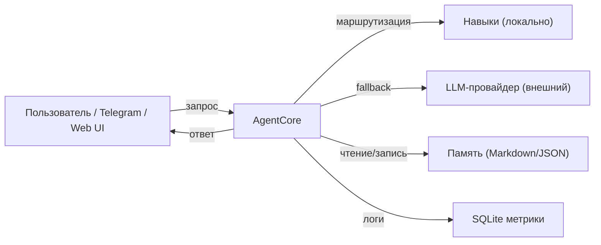
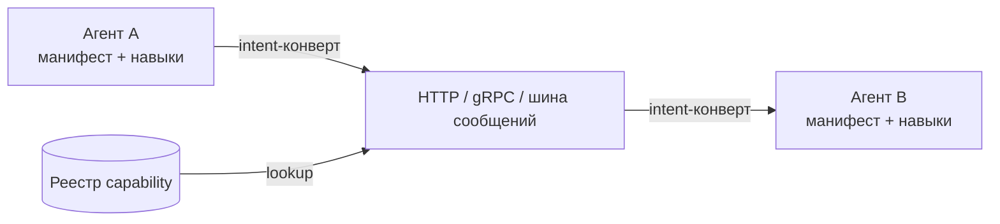
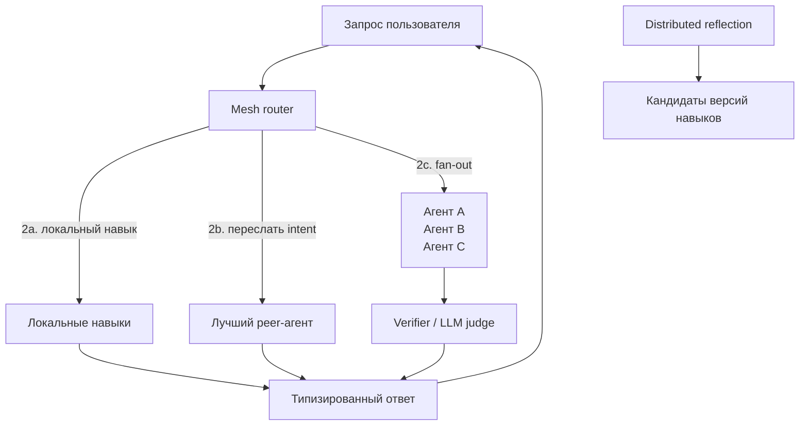
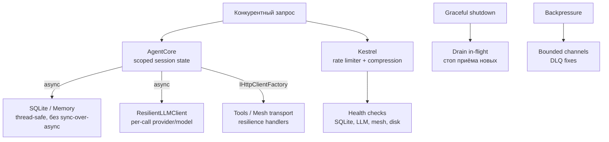

# Roadmap

Этот документ описывает план развития **Hercules** — крошечного самообучающегося ИИ-микроагента на C# / .NET 10. Цель не в том, чтобы построить одного большого ассистента, а в том, чтобы сделать минимально возможную автономную единицу, которую позже можно объединить в **agent mesh**: сеть специализированных микро-агентов, которые находят друг друга, вызывают друг друга и учатся друг у друга — по аналогии с тем, как микросервисы формируют прикладную архитектуру.

> Текущее состояние проекта см. в [CHANGELOG-RU.md](../CHANGELOG-RU.md).  
> Концепция mesh-архитектуры — в [docs/AGENT-MESH-RU.md](AGENT-MESH-RU.md).

---

## Ограничения проектирования микро-агента

Каждая фича в roadmap оценивается по этим ограничениям:

- **Single responsibility** — один агент делает одно дело хорошо.
- **Малый ресурсный след** — работает на скромном железе.
- **Самодостаточный runtime** — один исполняемый файл, один конфиг, одна папка данных.
- **OpenAI-совместимый интерфейс** — любой LLM-провайдер, локальный или облачный; edge-устройства используют внешний LLM.
- **Discoverable and callable** — обнаруживаем и вызываем по лёгкому протоколу (HTTP/gRPC или шина сообщений).
- **Версионированные навыки** — reusable, shareable, rollback-capable.
- **Готовность к edge** — работает на Raspberry Pi с внешним LLM, буферизирует данные офлайн.

---

## Phase 1 — Один автономный юнит (сейчас → Q3 2026)

Цель: доказать, что один агент Hercules может работать самостоятельно, учиться на собственном трафике и отдавать чистый API.

```mermaid
flowchart LR
    User["Пользователь / Telegram / Web UI"] -->|запрос| AgentCore["AgentCore"]
    AgentCore -->|маршрутизация| Skills["Навыки (локально)"]
    AgentCore -->|fallback| LLM["LLM-провайдер (внешний)"]
    AgentCore -->|чтение/запись| Memory["Память (Markdown/JSON)"]
    AgentCore -->|логи| SQLite["SQLite метрики"]
    AgentCore -->|ответ| User
```

| # | Инициатива | Результат |
| - | ---------- | --------- |
| 1 | **Core agent loop** | `AgentCore` обрабатывает запрос, маршрутизирует на навык или прямой вызов LLM, обновляет память и пишет метрики. |
| 2 | **Жизненный цикл навыка** | Создание, версионирование, улучшение и удаление навыков полностью автоматизированы; human-in-the-loop для высокорисковых изменений. |
| 3 | **Гибридное хранилище** | Markdown/JSON для навыков и памяти + SQLite для логов и метрик; без внешних зависимостей. |
| 4 | **Мульти-провайдер LLM** | YandexGPT, Ollama Cloud/Local, LM Studio через `Microsoft.Extensions.AI` с автоматическим fallback. |
| 5 | **Интерфейсы** | CLI REPL, Telegram-бот, ASP.NET Core Minimal API, Astro веб-интерфейс. |
| 6 | **Тесты и бенчмарки** | `dotnet test` ≥ 70 % покрытия; `dotnet run --benchmark` измеряет hit-rate навыков, latency и рост памяти. |

**Доставляемый результат:** standalone микро-агент, который любой может запустить локально.

---

## Phase 2 — Компонуемые навыки и инструменты (Q4 2026)

Цель: превратить навыки в переносимые, самодостаточные единицы, которые можно импортировать, экспортировать и связывать в цепочки. Это фундамент для **шаблонов агентов**, используемых в IoT-развёртываниях.

| # | Инициатива | Результат |
| - | ---------- | --------- |
| 7 | **Формат пакета навыка** | Навык — это папка с `skill.meta.json`, `skill.prompt.md`, `skill.tests.json` и опциональным `tool.schema.json`. |
| 8 | **Маркетплейс навыков** | `data/Skills/marketplace/` с командами импорта/экспорта в CLI и публичным репозиторием шаблонов. |
| 9 | **Семантическая маршрутизация** | `SkillRouter` ранжирует навыки по embedding-сходству с запросом, а не только по ключевым словам. |
| 10 | **Реестр инструментов** | Навыки декларируют инструменты (HTTP, файловая система, shell, БД, GPIO/MQTT), загружаемые из `data/Tools/` с allow/deny-списками. |
| 11 | **Шаблоны агентов** | Готовые bundles навыков + памяти + инструментов для вертикальных сценариев (теплица, энергия, холодовая цепь, серверная). |

**Доставляемый результат:** один агент может внутри себя компоновать несколько навыков и инструментов, а новое вертикальное развёртывание начинается с шаблона, а не с нуля.

---

## Phase 3 — Межагентный протокол (Q1 2027)

Цель: научить агентов общаться друг с другом по лёгкому, языконезависимому протоколу.

```mermaid
flowchart LR
    AgentA["Агент A\nманифест + навыки"] -->|intent-конверт| Bus["HTTP / gRPC / шина сообщений"]
    Bus -->|intent-конверт| AgentB["Агент B\nманифест + навыки"]
    Registry[("Реестр capability")] -->|lookup| Bus
```

| # | Инициатива | Результат |
| - | ---------- | --------- |
| 12 | **Agent manifest** | Каждый агент публикует `agent.manifest.json`: имя, версия, capabilities, навыки, endpoint, способ аутентификации. |
| 13 | **Реестр capability** | Локальный реестр (файл или SQLite) со списком известных агентов и того, что каждый умеет. |
| 14 | **Формат межагентного сообщения** | Стандартный JSON-конверт: `requestId`, `sender`, `intent`, `payload`, `replyTo`, `timeout`. |
| 15 | **Варианты транспорта** | HTTP/gRPC endpoint'ы плюс опциональный адаптер шины сообщений (RabbitMQ, NATS, Azure Service Bus). |
| 16 | **Механизмы discovery** | Статический конфиг, mDNS/Bonjour и lookup по реестру. |

**Доставляемый результат:** два агента Hercules могут найти друг друга и перенаправить запрос от одного к другому.

---

## Phase 4 — Оркестрация mesh (Q2 2027)

Цель: сеть микро-агентов ведёт себя как единая агентская система с маршрутизацией по capability, ограниченной делегацией, ретраями, observability, совместным обучением и опциональными распределёнными бэкендами для больших mesh.

```mermaid
flowchart TD
    User["Запрос пользователя"] --> Router["Mesh router"]
    Router -->|2a. локальный навык| Local["Локальные навыки"]
    Router -->|2b. переслать intent| Peer["Лучший peer-агент"]
    Router -->|2c. fan-out| Peers["Агент A\nАгент B\nАгент C"]
    Peers --> Judge["Verifier / LLM judge"]
    Local --> Response["Типизированный ответ"]
    Peer --> Response
    Judge --> Response
    Response --> User
    Eval["Distributed reflection"] --> Skills["Кандидаты версий навыков"]
```

| # | Инициатива | Результат |
| - | ---------- | --------- |
| 17 | **Mesh router** | Когда локальный навык отсутствует, неприменим или ниже confidence-threshold, агент пересылает запрос наиболее подходящему trusted peer-агенту по capability, policy, health, latency и ожидаемому качеству. |
| 18 | **Fan-out / fan-in** | Запрос можно разослать нескольким применимым агентам под строгими лимитами concurrency и бюджета; ответы валидируются по схемам и выбираются детерминированными правилами, голосованием или опциональным judge-моделью. |
| 19 | **Retry и circuit breaker** | Упавшие peer-вызовы используют deadline-aware retries, exponential backoff с jitter, per-peer circuit breaker'ы и bulkheads. Non-idempotent операции не ретраятся вслепую и требуют idempotency keys. |
| 20 | **Distributed reflection** | Отчёты рефлексии включают производительность peer-агентов, routing-решения, паттерны сбоев и предлагают новые навыки, routing-правила или peer-связи. Они создают proposals, а не unreviewed prod-изменения. |
| 21 | **Shared memory sync** | Избранные факты памяти и навыки синхронизируются между trusted агентами с явными namespaces, provenance, правилами разрешения конфликтов, TTL, шифрованием in transit и per-field data-classification policy. |
| 22 | **Verification pipeline** | High-impact или safety-sensitive ответы проверяются verifier-навыками, числовыми валидаторами, policy-enforcer'ами или независимыми peer-агентами до возврата или выполнения. |
| 23 | **Границы делегации** | Mesh ограничивает hop count, fan-out width, кумулятивные tool calls, общую стоимость и время на запрос. Агенты могут отклонить делегацию, чтобы не превышать свою policy или capacity. |
| 24 | **Human-in-the-loop эскалация** | Неоднозначные, low-confidence, разрушительные или policy-sensitive операции эскалируются с кратким action plan и контекстом для подтверждения человеком. Гейты выполнения обеспечиваются кодом, а не только промптами. |
| 25 | **Mesh observability** | Каждый локальный и межагентный шаг эмитит коррелированные traces, метрики и структурированные логи. Mesh-трафик, routing-решения, ретраи и взаимодействия с хранилищами видимы и атрибутируемы per request и per agent. |
| 26 | **Абстракция mesh-бэкендов** | Интерфейсы `IMeshBus`, `ITaskQueue` и `IMeshStateStore` отделяют mesh-оркестрацию от конкретных бэкендов. Single-host mesh продолжает работать с in-process очередями и SQLite по умолчанию. |
| 27 | **Redis/Valkey coordination backend** | Опциональный RESP-совместимый in-memory бэкенд (Redis или Valkey) даёт working memory, distributed locks и эфемерные очереди для координации при высокой concurrency. Durable truth остаётся в SQLite/PostgreSQL. |
| 28 | **Опция транспорта NATS / JetStream** | Опциональный NATS-бэкбон для сообщений: subject-based routing, queue groups для load-balanced agent workers, JetStream-стримы для durable at-least-once доставки и replay при дисконнектах. |
| 29 | **PostgreSQL shared state backend** | Опциональный PostgreSQL state store хранит cross-agent workflow state, shared skill registry, evaluation records и audit logs. Job-очереди используют `SKIP LOCKED` для умеренно-throughput исполнения. |
| 30 | **Backend-профили и деградация** | Профили развёртывания объявляют, какой mesh используется: только локальный SQLite, Redis/Valkey, NATS, PostgreSQL или комбинации. Если бэкенд становится недоступен, агенты деградируют в local-only режим или прекращают приём новых делегаций по policy, а не падают молча. |
| 31 | **Mesh evaluation suite** | Воспроизводимые сценарии измеряют task success, safety denials, routing quality, latency, cost, resilience и деградацию при отказе peer/tool/backend/LLM-провайдера. |

**Доставляемый результат:** mesh из 3–5 агентов Hercules безопасно отвечает на запросы, которые ни один агент не мог бы решить в одиночку, с ограниченной стоимостью и объяснимой делегацией. Большие swarm'ы могут подключать Redis/Valkey, NATS и PostgreSQL через configuration profiles, не делая ни один внешний сервис обязательным для одиночного локального агента.

---

## Phase 5 — IoT/edge-флит и эксплуатация mesh (Q3 2027)

Цель: сделать mesh production-ready, наблюдаемым и управляемым — включая флоты дешёвых edge-устройств.

| # | Инициатива | Результат |
| - | ---------- | --------- |
| 32 | **Mesh dashboard** | Веб-UI показывает живую топологию агентов, трафик между ними, health per-agent и heatmap использования навыков. |
| 33 | **Централизованное логирование и трассировка** | У каждого межагентного вызова есть `traceId`; логи можно сливать в OpenTelemetry/Loki и т.п. |
| 34 | **Идентификация и доверие** | Mutual TLS или API-key trust между агентами; ACL per-agent для навыков и памяти. |
| 35 | **Rate limiting и квоты** | Rate limits per-agent и per-skill; бюджеты стоимости LLM по всему mesh. |
| 36 | **Управление жизненным циклом** | CLI и API для запуска, остановки, обновления и rollback агентов в mesh. |
| 37 | **Edge provisioning** | Образ SD-карты / Docker-образ для Raspberry Pi с flow активации Wi-Fi и API-ключа при первом включении. |
| 38 | **Offline resilience** | Агент буферизирует сенсорные логи и исходящие алерты; синхронизируется с mesh/облаком при возвращении связи. |
| 39 | **Флит-шаблоны** | Один шаблон на вертикаль (теплица, холодовая цепь, серверная, вендинг) с валидированной спецификацией железа. |
| 40 | **Security operations** | Fleet-wide ротация identity, отзыв credentials, обновление сертификатов, проверка подписи пакетов, vulnerability reporting и экспорт security audit. |
| 41 | **Configuration и policy rollout** | Подписанные версионированные configuration и policy бандлы со staged rollout, local validation, expiry, rollback и last-known-good fallback. |
| 42 | **Local-first degradation** | Когда cloud LLM, peers или сеть недоступны, агент следует configured safe fallback: детерминированные правила, локальные навыки, reduced-capability модели, queued work и operator notification. |
| 43 | **Backup и recovery** | Encrypted backups покрывают configuration, skills, избранную память, данные SQLite и device identity; restore-процедуры автоматизированы и регулярно тестируются. |
| 44 | **Операционные SLO** | Каждый template объявляет availability, response-time, data-loss, recovery-time и cost objectives вместе с alert thresholds и runbook'ами. |

**Доставляемый результат:** mesh Hercules можно развёртывать как набор маленьких сервисов за gateway и как флот Raspberry Pi edge-агентов с операционной видимостью, подписанными configuration rollout'ами, encrypted backups, объявленными SLO и graceful degradation при недоступности внешних сервисов.

---

## Phase 6 — Performance и high availability hardening (Q4 2027)

Цель: закрыть все critical и high-severity находки из performance и HA review. Сделать агент и mesh безопасным под конкурентной нагрузкой, production-grade наблюдаемым и устойчивым к частичным сбоям без silent data loss или thread starvation.

```mermaid
flowchart TD
    Req["Конкурентный запрос"] --> AgentCore["AgentCore\nscoped session state"]
    AgentCore -->|async| Storage["SQLite / Memory\nthread-safe, без sync-over-async"]
    AgentCore -->|async| LLM["ResilientLLMClient\nper-call provider/model"]
    AgentCore -->|IHttpClientFactory| Tools["Tools / Mesh transport\nresilience handlers"]
    Req --> Kestrel["Kestrel\nrate limiter + compression"]
    Kestrel --> HealthChecks["Health checks\nSQLite, LLM, mesh, disk"]
    Shutdown["Graceful shutdown"] --> Drain["Drain in-flight\nстоп приёма новых"]
    Backpressure["Backpressure"] --> Bounded["Bounded channels\nDLQ fixes"]
```

| # | Инициатива | Результат |
| - | ---------- | --------- |
| 45 | **Critical correctness fixes** | Доступ к SQLite потокобезопасен без sync-over-async обёрток; NATS JetStream сообщения корректно ack/nak/term; QuotaService rate-limit baskets корректно очищаются; outbox synced-state сохраняет bounded-queue prune логику. |
| 46 | **High-availability fixes** | Captive DI зависимости и singleton mutable state устранены; `ResilientLLMClient` несёт provider/model per call; весь sync-over-async в горячих путях и background timers убран; `IHttpClientFactory` со standard resilience handlers используется везде; real health checks backs liveness/readiness probes; graceful shutdown drains in-flight requests; Kestrel limits, framework rate limiter, response compression и output cache настроены; router health, Redis CAS, Postgres reconnect и DI registration anti-patterns исправлены. |
| 47 | **Performance polish** | Cache stampede предотвращён через per-key dedup; eviction O(log n) через sorted expiry index; ProposalStore кешируется с FileSystemWatcher; StringBuilder pooling снижает GC pressure; OTel console exporter gated, process instrumentation включён, histogram buckets явные, retry logging sampled; bounded channels и DLQ requeue обеспечивают backpressure; miscellaneous hardening покрывает DelegationBoundary TTL, ResilientTransport semaphore trim, CORS defaults, backup passphrase enforcement, SLO real metrics, audit filters и silent-catch logging. |

**Доставляемый результат:** Агент и mesh Hercules выдерживают конкурентную нагрузку без thread starvation или data corruption, деградируют gracefully при частичных сбоях с real health-check видимостью, drain in-flight work при shutdown и production-observable с корректной per-call атрибуцией и sampled logging.

---

## Долгосрочное видение

Hercules становится **runtime для agent meshes**: крошечные, самообучающиеся, single-purpose агенты, которые находят друг друга, делегируют работу, делятся навыками и учатся коллективно. Mesh может жить на одной машине, в локальной сети или в облаке — компонуется как микросервисы, но со встроенным reasoning, памятью и адаптацией.

---

## Как повлиять на roadmap

- Откройте [discussion](../../discussions) для идей.
- Откройте [issue](../../issues) для конкретных багов или предложений.
- См. [CONTRIBUTING-RU.md](../CONTRIBUTING-RU.md) с гайдом по внесению вклада.
