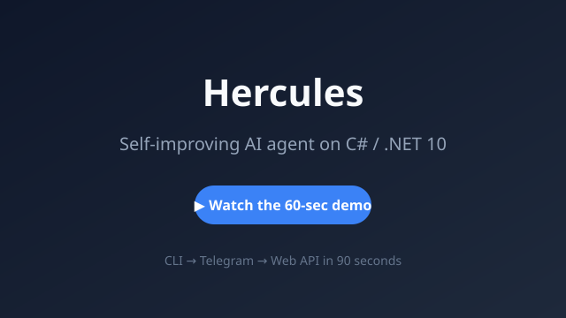

# Demo

A 60–90 second tour of Hercules: clone → run → CLI REPL → Telegram bot → Web UI.

The final video will be published here once the screen recording and voice-over are rendered.

In the meantime you can:

- [📁 Browse the examples](../examples)
- [🎬 Read the demo script](../assets/demo/demo-script.md)
- [🎙️ Generate the voice-over with `synthesize_speech.ps1`](../assets/demo/synthesize-speech.ps1)
- [📹 Record your own screen with `record-demo.ps1`](../assets/demo/record-demo.ps1)

## Narration

> Meet Hercules, a self-improving AI agent written in C-sharp and dot-net ten.
> It runs as a REPL. Ask a question, and Hercules answers with context-aware routing.
> Repeat a task, and Hercules proposes a skill, then improves it automatically.
> The same agent powers a Telegram bot, a Web API, and a React frontend.
> Or plug it into your own apps via the REST API and Astro dashboard.
> Star the repo, try the bot, and start building.
